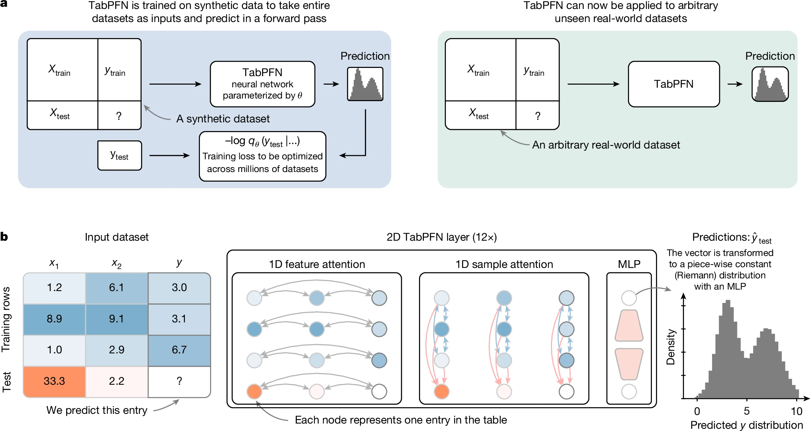

# TabPFN Extensions ⚡

[](https://badge.fury.io/py/tabpfn-extensions)
[](https://pepy.tech/project/tabpfn)
[](https://opensource.org/licenses/Apache-2.0)
[](https://discord.com/channels/1285598202732482621/)
[](https://twitter.com/Prior_Labs)




## 🛠️ Available Extensions

- **post_hoc_ensembles**: Improve performance with model combination
- **interpretability**: Explain TabPFN predictions with SHAP values and feature selection
- **many_class**: Handle classification with more classes than TabPFN's default limit
- **classifier_as_regressor**: Use TabPFN's classifier for regression tasks
- **hpo**: Automatic hyperparameter tuning for TabPFN
- **rf_pfn**: Combine TabPFN with decision trees and random forests
- **unsupervised**: Data generation and outlier detection
- **embedding**: Get TabPFNs internal dense sample embeddings

Detailed documentation for each extension is available in the respective module directories.

## ⚙️ Installation

```bash
# Clone and install the repository
pip install "tabpfn-extensions[all] @ git+https://github.com/PriorLabs/tabpfn-extensions.git"
```

### 🔄 Backend Options

TabPFN Extensions works with two TabPFN implementations:

1. **🖥️ TabPFN Package** - Full PyTorch implementation for local inference:
   ```bash
   pip install tabpfn
   ```

2. **☁️ TabPFN Client** - Lightweight API client for cloud-based inference:
   ```bash
   pip install tabpfn-client
   ```

Choose the backend that fits your needs - most extensions work with either option!

## 📝 License

This project is licensed under the Apache License 2.0 - see the [LICENSE](LICENSE) file for details.

## 🧑‍💻 For Contributors

Interested in adding your own extension? We welcome contributions!

```bash
# Clone and set up for development
git clone https://github.com/PriorLabs/tabpfn-extensions.git
cd tabpfn-extensions

# Lightweight dev setup (fast)
pip install -e ".[dev]"

# Test your extension with fast mode
FAST_TEST_MODE=1 pytest tests/test_your_extension.py -v
```

See our [Contribution Guide](CONTRIBUTING.md) for more details.

[](https://github.com/priorlabs/tabpfn-extensions/graphs/contributors)

## 📦 Repository Structure

Each extension lives in its own subpackage:

```
tabpfn-extensions/
├── src/
│   └── tabpfn_extensions/
│       └── your_package/      # Extension implementation
├── examples/
│   └── your_package/          # Usage examples
└── tests/
    └── your_package/          # Tests
```

---

Built with ❤️ by the TabPFN community
